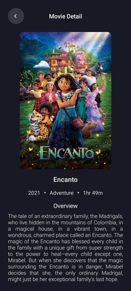

Cinephile - Simple Movie Discovery App
======================================

Tech Stack of the Cinephile
---------------------------

* Jetpack Compose
* Coroutines
* StateFlow
* Retrofit2
* Dagger-Hilt
* MVVM Pattern

Content Resource
----------------

TMDB free movie database API used as content provider service. 
You can also get a free API Key from [TMDB Developers](https://developers.themoviedb.org/3/getting-started/introduction) ! :) .

Cinephile Preview
----------------

**Home Screen**

**Movie Detail Screen**

 

